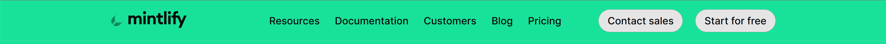
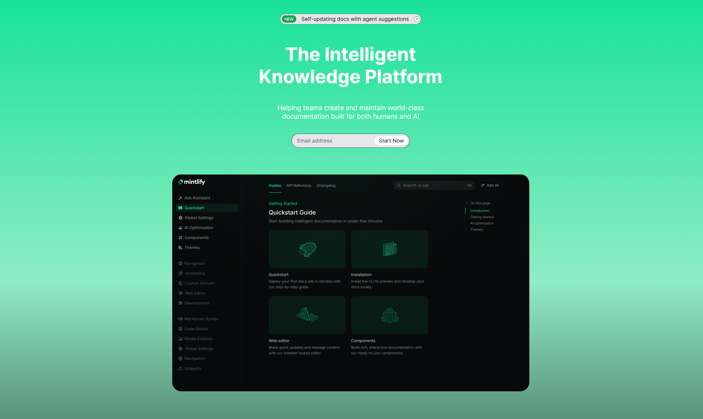
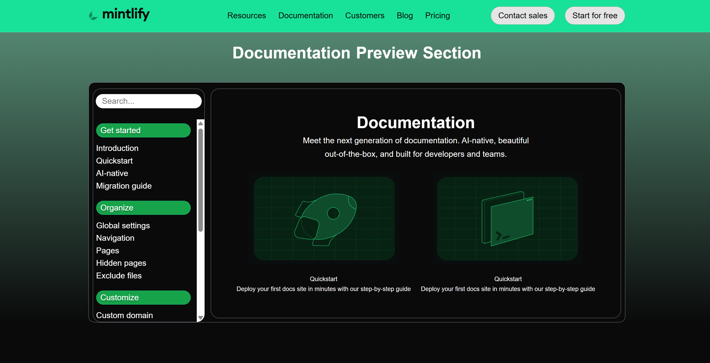
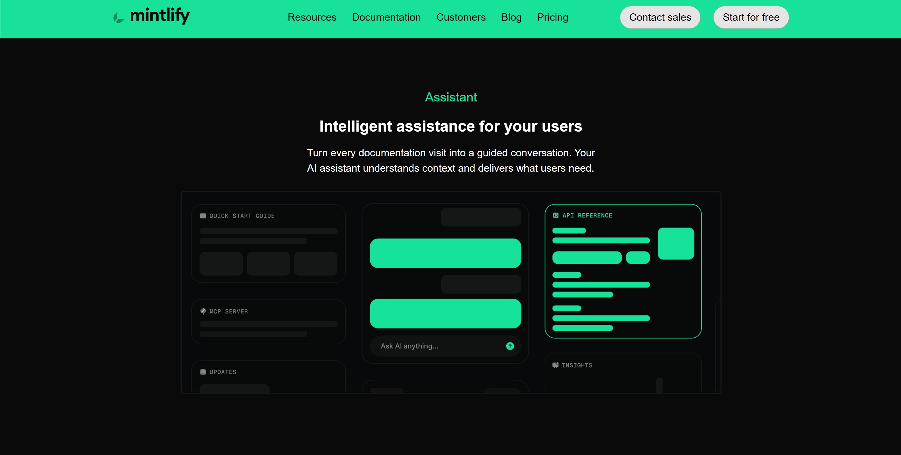
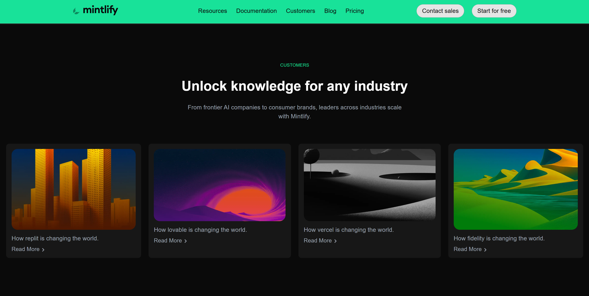
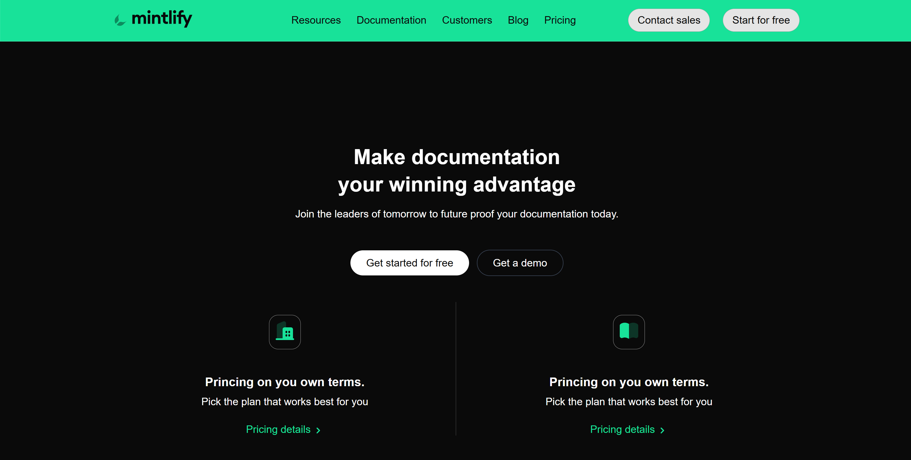
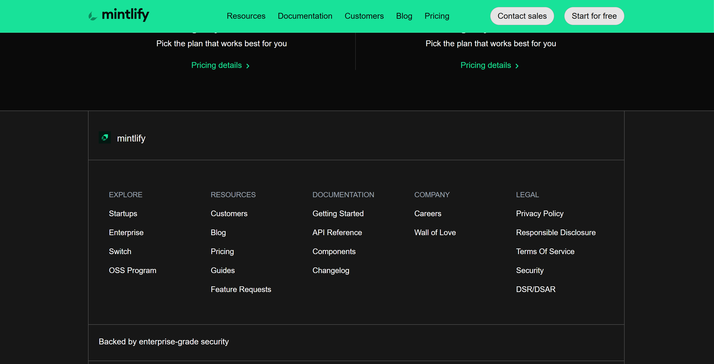

# Mintlify Landing Page Clone

This project is a static clone of the **Mintlify landing page**, built using **HTML and CSS**.  
The goal of this assignment is to get better at HTML and CSS.

---

## Project Structure

- **index.html** – Contains the markup for the landing page
- **style.css** – Handles all styling and layout
- **public/** – Stores all images and SVG assets used in the making of the landing page
- **layout-screenshots/** - Stores all the screenshots for different sections of the page.

---

## 🛠️ Tech Stack

- **HTML5**
- **CSS3**

---

## Fonts & Colors Used

### Font Family

- **Inter**, sans-serif  
  Imported and used across the entire layout:
  ```css
  font-family: "Inter", sans-serif;
  ```

## Project Color Palette

This assignment uses a dark, modern UI color system with a strong green accent.

**Backgrounds**

- Main Background: `#0a0a0a`
- Section / Card Background: `#171717`

**Text Colors**

- Primary Text: `#ffffff`
- Secondary Text: `#d1d5db`

**Accent / Highlights**

- Primary Accent Green: `#18e299`
- Secondary Accent Green: `#16a34a`

**CTA**

- Primary CTA Background: `#ffffff`
- CTA Text: `#0a0a0a`

**Borders & UI Elements**

- Standard Borders: `#6b7280`
- Subtle UI Borders: `#404040`, `#525252`

## Assets

All images and icons used in this project are stored inside the `public` folder and are used only for **educational and practice purposes**.

---

## What I Built

This project recreates the **visual layout and structure** of the Mintlify landing page, including:

- Sticky navigation bar with call-to-action buttons

  

- Hero section with gradient background

  

- Documentation preview layout with sidebar + main content

  

- Feature cards using CSS Grid

  

- Assistant preview section

  

- Enterprise section with split layout

  

- Case study cards

  

- Pricing CTA

  

- Footer with multi-column layout

  

## How to Run the Project

1. Clone the repository
2. Open `index.html` in your browser

No build tools or dependencies required.
